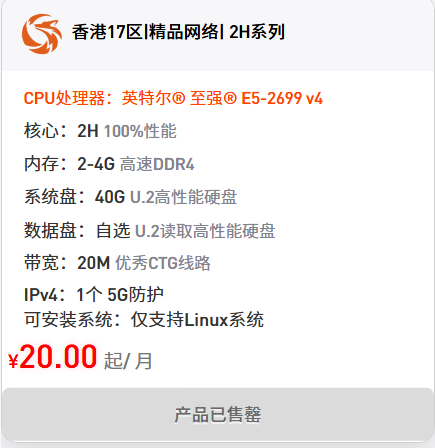
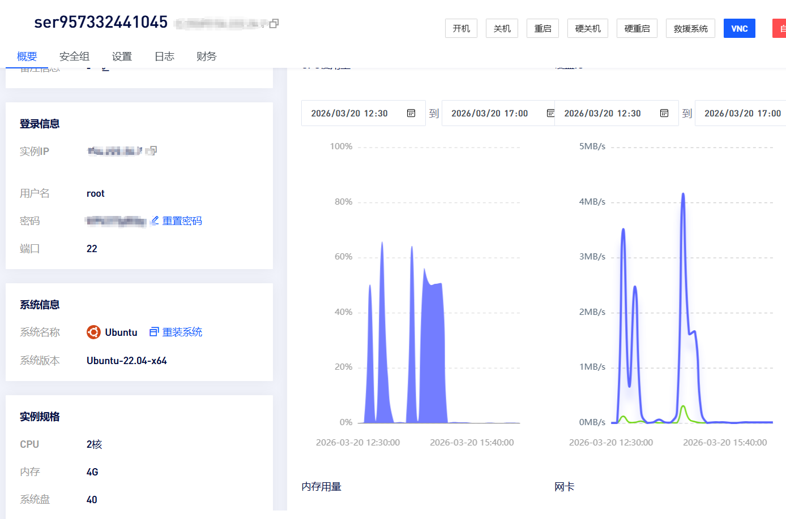
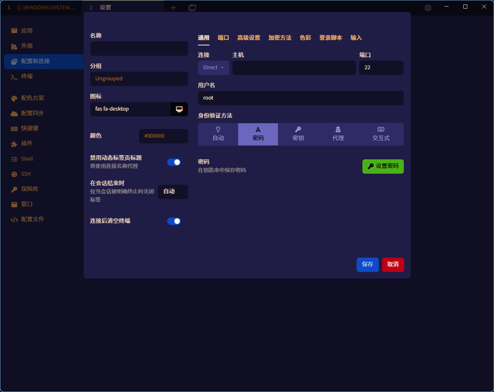
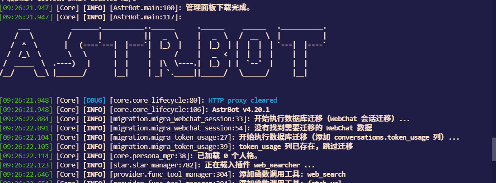
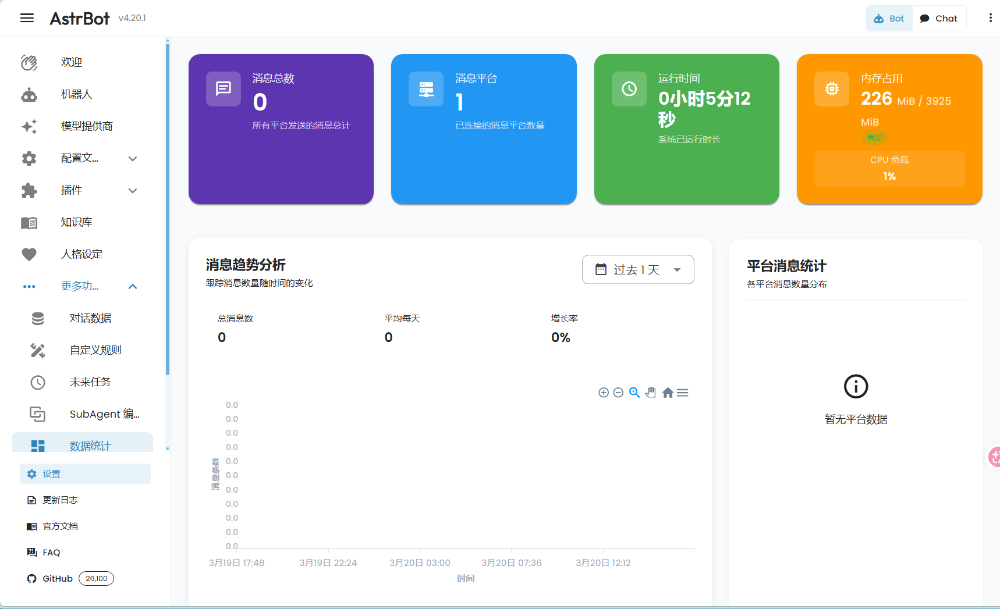
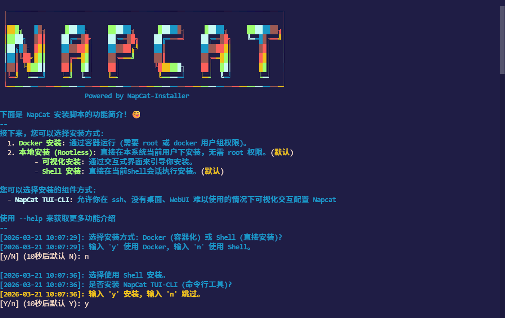
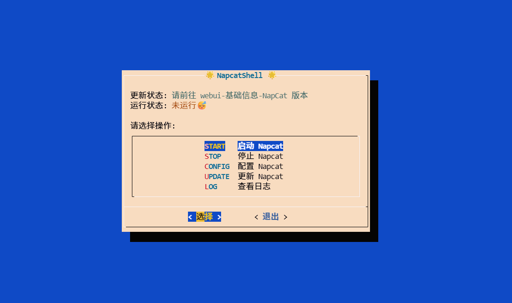

# 领养一只属于你的Astrbot 搭建教程

现在Openclaw 非常火爆，但是还有一个国产的机器人框架，那就是Astrbot。其实也非常的好用。不仅可以安装各种skills，还有很多开源插件可以使用。

## 要求：

- 一台云服务器(本文使用[狐蒂云](https://www.szhdy.com/))
- 一个ssh工具(连接云服务器的工具)
- 大模型api key
- 一个脑子
- 一个空闲的qq号
## 第一关：服务器选购

实际上有很多便宜的服务器可以选择比如阿里云,腾讯云等，这些新人用户和学生认证用户都有折扣。但是作者的优惠都用完了所以只能选择一个相对便宜的服务器了，狐蒂云 2h4g（其实2h2g也够用）,价格在25/月。


购买以后就可以到我们的控制台的管理实例界面看见正在运行的服务器的相关信息了


我们需要的就是这个服务器ip地址和密码（对于选择云服务器为腾讯，阿里等较大的厂商时，可能使用的密钥）

## 第二关：远程连接服务器

服务器的连接是使用的ssh协议,有很多好用的ssh协议工具。这里介绍的工具是Tabby。这实际上是一个终端工具，比较好看，界面比较美观，因此选择这个工具，至于性能，并不在我的考虑范围内（

下载好Tabby 后进入设置界面，添加新的ssh连接。


把云服务商给的密码和ip填入即可。连接成功后就会进入如下界面


## 第三关：安装astrbot

我们可以访问astrbot的主页，可以看见安装方法有很多种。最简单的是使用uv安装。但是笔者实测这样安装好像不太方便更新，在本文中采取的安装方式为从源码构建。自从python有了uv这个包管理工具后从构建python源码真是轻轻又松松。

我们首先安装uv
```bash
curl -LsSf https://astral.sh/uv/install.sh | sh
```
安装以后重新连接终端，再测试uv命令是否生效

```bash
root@ser957332441045:~# uv -V
uv 0.10.12 (x86_64-unknown-linux-gnu)
```
然后在服务器中选择一个文件夹(使用cd 命令切换文件夹),再把Astrbot的源码用git拉下来,并切换到Astrbot文件夹下。
```bash
git clone https://github.com/AstrBotDevs/AstrBot.git
cd Astrbot
```
然后我们使用uv构建源码,并run
```bash
uv sync
uv run main.py
```

出现了如下界面就是说明Astrbot 安装成功



Astrbot的默认端口是6185。然后我们就可以再浏览器中输入ip:6185。访问我们的Astrbot的面板。默认用户名与密码就是astrbot。登录进去后就可以看见面板咯



从源码启动有几个问题，如果关闭启动终端,那服务就停了。如果服务器不小心重启了，你又要重新打开终端运行启动命令。

所以这里采用systemd的方法。把Astrbot 程序，注册为systemd应用，使用systemctl 管理，可以在开机时自启，自己在后台运行。

首先创建systemd服务文件

```bash
vim /etc/systemd/system/astrbot.service
```

向里面复制如下内容
```ini
[Unit]
Description=My Python Application
After=network.target

[Service]
Type=simple
User=你的用户名
WorkingDirectory=/astrbot路径
ExecStart= 你的uv地址 run --no-sync main.py
Restart=always
RestartSec=5

[Install]
WantedBy=multi-user.target
```

把上述中文位置替代成对应位置即可。uv命令的位置可用which命令查看
```bash
which uv
```

退出保存后运行
```bash
systemctl daemon-reload
```
更新配置
systemctl 的常见命令如下
```bash
systemctl start astrbot #运行服务
systemctl stop astrbot # 停止服务
systemctl enable astrbot # 开机自启服务
systemctl status astrbot # 查看服务状态 q键退出 
```
接下来我们就可以使用start 命令启动服务，然后使用status 命令查看服务状态。

## 第四关: 安装NapCat

首先我们要明白astrbot其实是一个两面插座，一面接入大模型api,一面接入聊天平台。光有astrbot,还不能实现聊天机器人，我们还需要找一个聊天平台。各大聊天平台基本都有官方的机器人接口,但是官方的限制太多了,这里的NapCat就是通过逆向NTqq,然后实现了收发消息等各种接口的开源程序。

我们在云服务器中首先部署NapCat程序,NapCat 会让你登录机器人的qq,然后NapCat 会监听qq机器人的信息。NapCat 作为客户端,把信息发给astrbot平台,astrbot才会响应。

NapCat 的安装命令
```bash
curl -o \
napcat.sh \
https://nclatest.znin.net/NapNeko/NapCat-Installer/main/script/install.sh \
&& bash napcat.sh
```

安装的时候会有两个选项
一个是是否以docker 的形式安装，选择n
一个是是否安装tui,选择y。安装界面如下：


然后接下来就按回车就好，等它自动安装完成。

最后输入napcat测试 ,进入tui面板



然后我们选择Config,新建QQ号.再配置QQ号,选择第4个WebSocket客户端。需要配置以下内容
- 名称（随便起）
- url （改为ws://localhost:6199/ws）
- 心跳间隔（不变）
- 重连间隔（不变）
- Token (记住就行)

确认后选择消息模式：数组模式。最后勾选上启用服务,再点击OK。
然后回到操作页面，选择启动Napcat。这里终端会出现二维码，手机登录你准备的机器人qq扫码即可。


## 第五关：超级拼装

前面我们已经在后台启动好了astrbot与napcat。我们需要在astrbot的webui中进行关联，并将大模型api接入astrbot中。这样我们就可以在qq上实现基本的大模型对话了。


我们首先使用ip:6185 访问astrbot的webui。然后配置平台机器人，选择消息平台类别为onebot v11。需要配置的选项有

- 机器人名称 （随便取）
- 启用（打开）
- 反向主机（0.0.0.0）
- 反向端口（就是Napcat中配置的端口）
- 反向token(Napcat中配置的token)


然后就是在astrbot中配置大模型api。记住模型提供商，模型名字，和api key 就行。我这里选择的是minimax的模型。

最后就可以进行正常的对话了。


