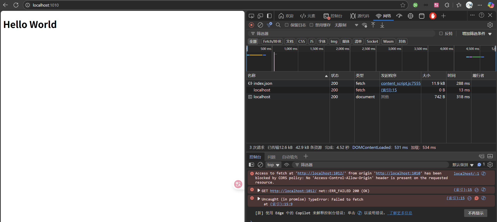
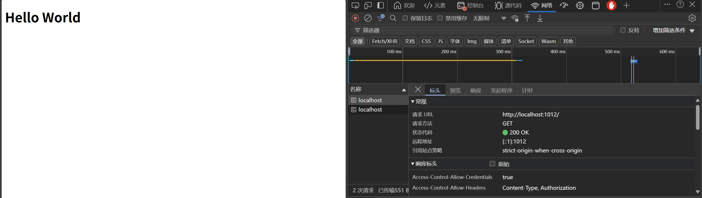
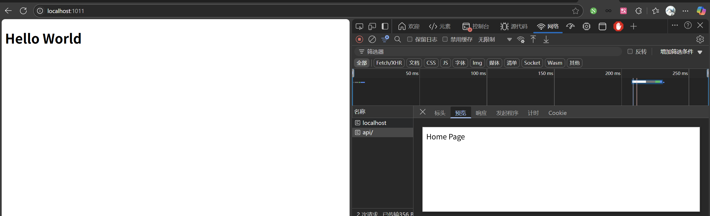

## 前后端跨域存在的原因

前后端跨域原因是因为浏览器的安全政策，浏览器只允许与访问页面**同源**的请求接受。**同源**指访问协议、域名、端口号均相同。如果你的前端服务器与后端服务器不同源。用户访问你的前端服务器，获取到前端代码后，前端代码中有访问后端服务器的请求，用户浏览器就会认为不同源，于是拒绝该应答。

解决方法主要4种。

-   jsonp （非常古老）

-   后端加标头（）

-   Nginx 加标头

-   Nginx 反向代理

## 实验

本次，笔者将做一个实验，来分别实验这四种方法实现。

实验环境：win11，nodejs 16.12.0，nginx 1.26.3

前端：静态页面，使用nginx作为http服务器，端口为1010

nginx反向代理服务器：端口为1011

后端：使用nodejs作为后端，采用express框架

## jsonp

jsonp 本质是利用浏览器对前端代码中的srcipt标签中src的请求是没有跨域限制的，而实现依靠src来传递数据。需要对前后端都有一定更改。

前端代码如下

    // index.html
    <!DOCTYPE html>
    <html lang="en">
    <head>
        <meta charset="UTF-8">
        <meta name="viewport" content="width=device-width, initial-scale=1.0">
        <title>Document</title>
    </head>
    <body>
        

            

                <h1>Hello World</h1>
            

        

        
    </body>

后端代码如下：

    // server.js
    const express = require('express');
    const app = express();
    const port = 1012;
    
    // 中间件：解析 JSON 请求体
    app.use(express.json());
    
    // 路由示例
    app.get('/', (req, res) => {
      res.send('Home Page');
    });
    
    app.post('/api/data', (req, res) => {
      console.log(req.body); // 获取 POST 数据
      res.json({ message: 'Data received' });
    });
    
    // 启动服务器
    app.listen(port, () => {
      console.log(`Server on http://localhost:${port}`);
    });

nginx 配置：

    server{
        listen 1010;
        server_name localhost;
        location / {
            root C:/Code/temp/frontend;
            index index.html;
        }
      
    }

此时浏览器访问localhost:1010端口，可以直接跨域访问

如果我们，在script中对后端请求，则会触发跨域问题，此时前端代码如下：

    <!DOCTYPE html>
    <html lang="en">
    <head>
        <meta charset="UTF-8">
        <meta name="viewport" content="width=device-width, initial-scale=1.0">
        <title>Document</title>
    </head>
    <body>
        

            

                <h1>Hello World</h1>
            

        

        
    </body>

## 后端加标头

现代浏览器为了实现跨域，后端返回应答时，加上相应的请求头，就允许跨域。

后端此时改为：

    const express = require('express');
    const app = express();
    const port = 1012;
    
    // 中间件：解析 JSON 请求体
    app.use(express.json());
    
    // 路由示例
    app.get('/', (req, res) => {
    
      res.setHeader('Access-Control-Allow-Origin', "*");
      
      // 允许的请求方法
      res.setHeader('Access-Control-Allow-Methods', 'GET, POST, PUT, DELETE, OPTIONS');
      
      // 允许的请求头
      res.setHeader('Access-Control-Allow-Headers', 'Content-Type, Authorization');
      
      // 允许携带凭证
      res.setHeader('Access-Control-Allow-Credentials', true);
    
      res.send('Home Page');
    });
    
    app.post('/api/data', (req, res) => {
      console.log(req.body); // 获取 POST 数据
      res.json({ message: 'Data received' });
    });
    
    // 启动服务器
    app.listen(port, () => {
      console.log(`Server on http://localhost:${port}`);
    });

此时即可运行成功：

不同的后端都有对应库实现这样加标头的操作。操作起来比较简单，但是要取决于浏览器是否支持

## Nginx 加标头

处理后端可以加标头，Nginx 也可以加表头，使用Nginx加标头主要可以实现解耦，网络的事就由网络这边来解决，后端就专心写业务代码就好了，不用管跨域的事情。

方法就是建一个在1011端口启动一个nginx反代服务器，前端访问1011端口获取数据，nginx代理给后端，并在返回时添加处理跨域的标头，

Nginx 配置文件如下：

    server{
        listen 1011;
        server_name localhost;
        location / {
            add_header 'Access-Control-Allow-Origin' '*';
            proxy_pass http://localhost:1012;
            
        }
    }

这样前端就可以正常访问了

## Nginx 反向代理

接下来就是个人认为最合理的一种解决方案。跨域的原因是前后端不同源，但是我们可以利用Nginx反向代理的能力，让前后端请求同源。首先，nginx会配置两个代理路线，一个是主域名，一个是主域名加/api,当用户访问主域名时，Nginx把请求转发给前端服务器，用户浏览器获取到前端服务器代码后，前端代码中所有对后端的请求必须时相对路由，且以/api开头。这样完整的访问又会被Nginx给转发给后端。此时在浏览器中进行的所有请求都是同源的，就解决了跨域问题。

前端代码如下：

    <!DOCTYPE html>
    <html lang="en">
    <head>
        <meta charset="UTF-8">
        <meta name="viewport" content="width=device-width, initial-scale=1.0">
        <title>Document</title>
    </head>
    <body>
        

            

                <h1>Hello World</h1>
            

        

        
    </body>

后端代码如下：

    const express = require('express');
    const app = express();
    const port = 1012;
    
    // 中间件：解析 JSON 请求体
    app.use(express.json());
    
    // 路由示例
    app.get('/', (req, res) => {
    
      res.send('Home Page');
    });
    
    app.get('/api',(req,res)=>{
      res.send('apt Home Page');
    });
    
    app.post('/api/data', (req, res) => {
      console.log(req.body); // 获取 POST 数据
      res.json({ message: 'Data received' });
    });
    
    // 启动服务器
    app.listen(port, () => {
      console.log(`Server on http://localhost:${port}`);
    });

nginx 配置如下：

    server{
        listen 1011;
        server_name localhost;
        location / {
            proxy_pass http://localhost:1010;
        }
    
       location /api/ {
            # 1. 重写路径：去掉 /api 前缀
            rewrite ^/api/(.*) /$1 break;
    
            # 2. 代理到后端服务（注意此处不要带 /api 前缀）
            proxy_pass http://localhost:1012;
        }
    }

最终运行结果如下：

这里也有两种选择，一种是后端写接口是，都有api/开头，一种是交给nginx,转发时rewrite路由。
