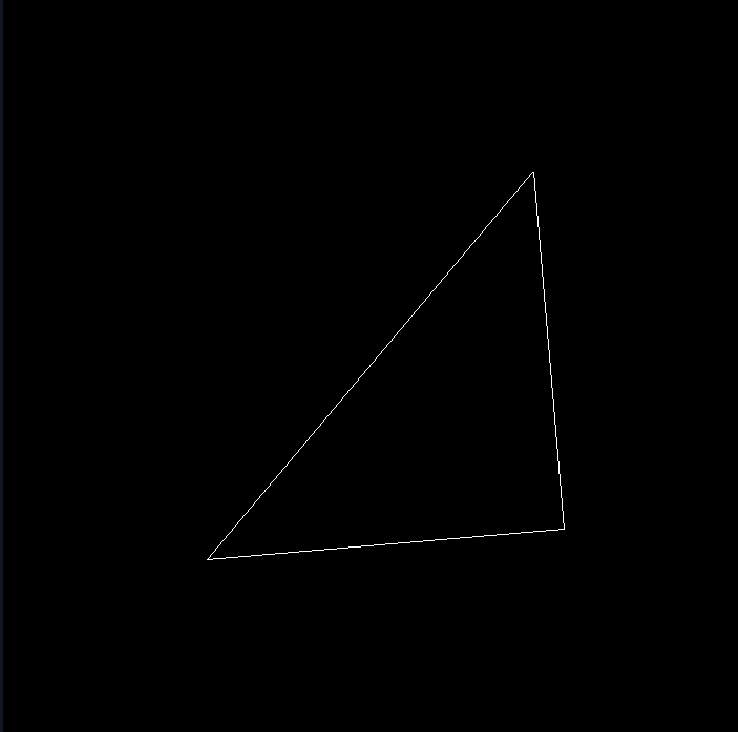
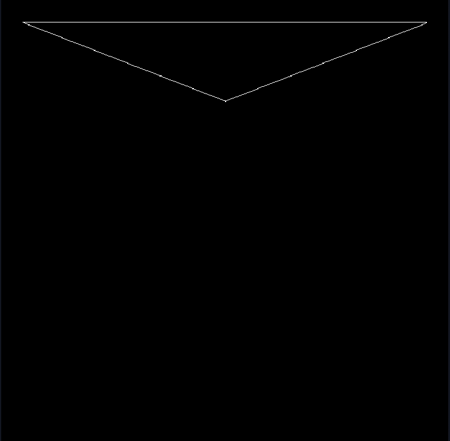

# games101 作业一

## 概述

作业一主要是涉及MVP变化的三个矩阵是怎么样构成的。

- M: model 变换。从模型坐标空间到世界坐标空间，涉及平移，旋转，放缩
- V：view 变换。从世界坐标空间到相机坐标空间。与相机的位置和朝向有关。
- P: 投影变换。从相机坐标空间到标准视域空间。涉及两个特殊的投影矩阵

## 具体实现

### 题目要求一：

> get_model_matrix(float rotation_angle): 逐个元素地构建模型变换矩阵并返回该矩阵。在此函数中，你只需要实现三维中绕 z 轴旋转的变换矩阵，而不用处理平移与缩放。

就是实现一个z轴的旋转矩阵

``` c++
Eigen::Matrix4f get_model_matrix(float rotation_angle)
{
    Eigen::Matrix4f model = Eigen::Matrix4f::Identity();

    float rad = rotation_angle / 180.0 * MY_PI;
    model << cos(rad), -sin(rad), 0, 0,
        sin(rad), cos(rad), 0, 0,
        0, 0, 1, 0,
        0, 0, 0, 1;
    // TODO: Implement this function
    // Create the model matrix for rotating the triangle around the Z axis.
    // Then return it.

    return model;
}
```
注意一下输入角度是弧度制还是角度制

### 题目要求2

> get_projection_matrix(float eye_fov, float aspect_ratio, float zNear, float zFar): 使用给定的参数逐个元素地构建透视投影矩阵并返回该矩阵。

实现一个投影矩阵。投影矩阵由两部分组成，一是透视投影矩阵，一部分是正交投影矩阵。这两个矩阵基本是定死的，没什么变化。


$$
M_{presp} = \begin{pmatrix}
    n&0&0&0\\
    0&n&0&0\\
    0&0&n+f&-n*f\\
    0&0&1&0
\end{pmatrix} 
$$

$$ 
M_ortho = \begin{pmatrix}
    \frac{2}{r-l}&&&-\frac{r+l}{r-l}\\
    &\frac{2}{t-b}&&-\frac{t+b}{t-b}\\
    &&\frac{2}{n-f}&-\frac{n+f}{n-f}\\
    &&&1\\
\end{pmatrix}
$$

编码计算即可。代码如下：
```c++
Eigen::Matrix4f get_projection_matrix(float eye_fov, float aspect_ratio,
                                      float zNear, float zFar)
{
    // Students will implement this function

    Eigen::Matrix4f projection = Eigen::Matrix4f::Identity();
    float t = tan(eye_fov / 2 / 180.0 * MY_PI) * abs(zNear);
    float r = t * aspect_ratio;
    Eigen::Matrix4f Mpresp;
    Mpresp << zNear, 0, 0, 0,
        0, zNear, 0, 0,
        0, 0, zNear + zFar, -zNear * zFar,
        0, 0, 1, 0;


    Eigen::Matrix4f Morth;
    Morth << 1 / r, 0, 0, 0,
        0, 1 / t, 0, 0,
        0, 0, 2 / (zNear - zFar), -(zNear + zFar) / (zNear - zFar),
        0, 0, 0, 1;
    // TODO: Implement this function
    // Create the projection matrix for the given parameters.
    // Then return it.
    projection = Morth * Mpresp;
    return projection;
}
```

### 作业要求三

> 在 main.cpp 中构造一个函数，该函数的作用是得到绕任意过原点的轴的旋转变换矩阵。


主要就是了解一下 Rodrigue 旋转公式

$$
R(\vec{n},\theta) = \cos{\theta}* \mathbf{I}+ (1-\cos{\theta})*\mathbf{I}*\mathbf{I}^\top  + \sin{\theta} * \begin{pmatrix}
    &-n_z&n_y\\
    n_z&&\\
    -n_y&n_x&\\
\end{pmatrix}
$$


还有Eigen 库中的一些处理矩阵的方法。

```c++
Eigen::Matrix4f get_model_matrix(Eigen::Vector3f axis, float angle)
{
    Eigen::Matrix4f model = Eigen::Matrix4f::Identity();
    float rad = angle / 180.0 * MY_PI;
    Eigen::Matrix3f I = Eigen::Matrix3f::Identity();
    Eigen::Vector3f a = axis.normalized();
    axis = a;
    Eigen::Matrix3f N;
    N << 0, -axis[2], axis[1],
        axis[2], 0, -axis[0],
        -axis[1], axis[0], 0;
    Eigen::Matrix3f R;
    R = cos(rad) * I + (1 - cos(rad)) * axis * axis.transpose() + sin(rad) * N;
    model.block<3, 3>(0, 0) = R;
    return model;
}
```

然后改写主函数中的参数逻辑，使用-l 参数时后接坐标轴向量，调用定任意轴转动的M矩阵

### 结果


