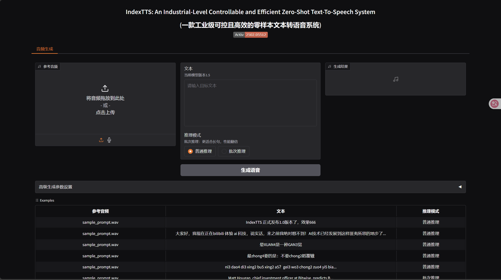

# Index-tts使用教程

index-tts 是一个开源的零样本语音复制工具。主要支持中文和英文。仅需要几秒的语音素材，就可以克隆出非常相近的语音音色。

## 环境

- WSL2 Ubuntu20
- 3060tap 6GB显存

## 下载

首先在**wsl2**，中使用git 进行下载源码

`git clone https://github.com/index-tts/index-tts.git`

然后进行新建一个conda环境

```
conda create -n index-tts python=3.10
conda activate index-tts
```

再安装ffmpeg。（这是一个非常牛逼的格式转换内核）

```
sudo apt-get update
sudo apt-get install ffmpeg
```

然后安装指定版本torch

```
pip install torch torchaudio --index-url https://download.pytorch.org/whl/cu118
```

最后进入到index-tts文件夹，把index-tts 添加为包

```
cd index-tts
pip install -e .
```

然后从huggingface上下载模型

可以先换一下下载源，这样从中国下载应该要快些

```
export HF_ENDPOINT="https://hf-mirror.com"
huggingface-cli download IndexTeam/IndexTTS-1.5 \
  config.yaml bigvgan_discriminator.pth bigvgan_generator.pth bpe.model dvae.pth gpt.pth unigram_12000.vocab \
  --local-dir checkpoints
```

然后直接启动webui

```
python webui.py
```


启动结束后，在浏览器中输入：`http://127.0.0.1:7860`进入webui



然后上传10s左右的wav格式的音频就可以开始生成。
