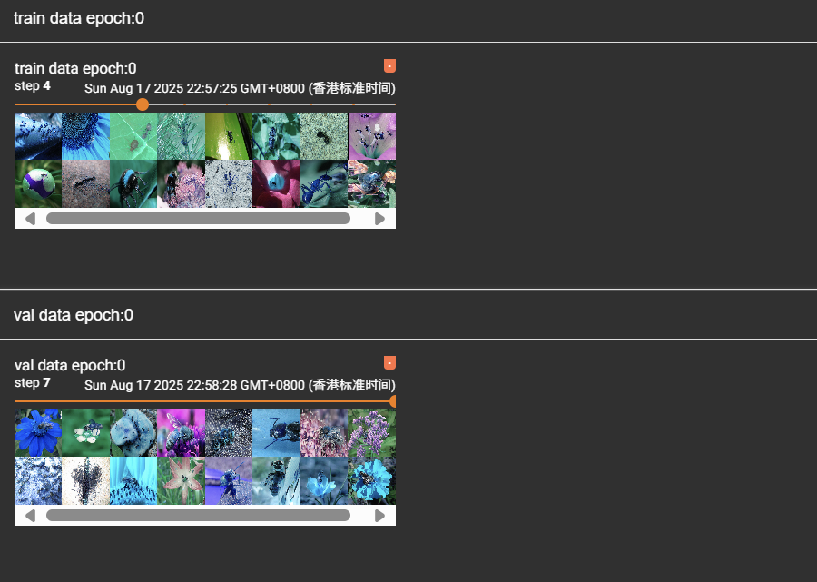

# Pytorch 学习系列01

之前有大概了解过深度学习训练的过程。但也仅仅是大概，现在虽然也出了很多模型微调，推理，训练一体化集成工具，但是Pytorch才是永远的底层，真神。

现在有时间了，需要可以进一步了解Pytorch。

深度学习毕竟是数据的科学，因此在学习pytorch的使用过程中不可避免的要用到别的数据科学的库，正好可以一起学一下。

例如：opencv,PIL，numpy

## Dataset

首先从数据集开始。

这个类是pytorch中自定义数据集的基类。使用pytorch训练的数据，均需要继承该类

首先导入：`from torch.utils.data import Dataset`

主要是用于重写`__getitem__(idx)`和`__len__()`这两个函数

`__getitem__`返回格式为`data,label`。data可以是任意格式的数据，对应训练而已常见的是ndarray或者tensor。label的字符串

`__len__` 返回格式为int 即数据长度

根据自定义数据集，重写这两个函数

## DataLoader

用于从Dataset中取数据，然后喂给之后的模型。

导入方法：`from torch.utils.data import DataLoader`

DataLoader的常用参数有：

- dataset 
- num_workers 
- batch_size 
- drop_last 是否需要把除不尽的部分舍弃
- shuffle ：打乱

例如:一个数据集(data: tensor(3,255,255), label:string)

然后经过一个DataLoader(batch_size = 4) 每次访问一次dataloader这个迭代器，获取的数据就会变成

（data:tensor(4,3,255,255),lable:[string]）

## Transforms

数据集的格式变换。一般在Dataset加载时完成

导入方法:`from torchvision import transforms`

常用的transform的方法：

- toTensor() : 可以把ndarray 或者 PIL image 类型的数据变为tensor 格式同时可以标准化。
- Resize():参数为一个数组，（h,w）。把指定图像，resize到这么大。
- Compose: 把多个transform操作合起来

## Tensorboard

可视化方法。今天先仅仅简单设计，稍微可视化一下结果。使用了Tensorboard中的SummaryWriter

导入包`from torch.utils.tensorboar import SummaryWriter`

仅介绍该类的几个方法：

- add_scale(tag,scalar_value,global_step) 添加标量数据,scalar相当于y轴，global_steps相当于x轴
- add_image(tag,img_tensor,global_step) 添加图片形式

这两个方法都有对应的复数形式

## 其他数据处理库

### OpenCV

图像处理常用函数：`cv2.imread(img_path)`

返回的数据是ndarray格式

### PIL

图像处理方法：`im = PIL.Image.open(img_path)`

返回数据为PIL的图片格式


## 实战

根据一个数据集，实现一个自己的数据集的类。再使用DataLoader加载,加载以后，使用tensorborad展示结果。

数据集为一个蚂蚁和蜜蜂的二分类数据集

数据集结果如下：

```
datasets
├─train
│  ├─ants
│  └─bees
└─val
    ├─ants
    └─bees
```


Dataset代码如下：

```python
import cv2 
import os
from torch.utils.data import Dataset
from torchvision import transforms


class MyDataset(Dataset):
    def __init__(self,root,train,transform=None):
        self.root = root
        self.train = train
        self.train_data = []
        self.val_data = []
        self.getData()

        if transform:
            self.transform = transform
        else:
            self.transform = transforms.Compose([
                transforms.ToTensor(),
                transforms.Resize((512,512))
            ])


        

    def __getitem__(self,idx):
        
        if self.train:
            img_path  = self.train_data[idx]
        else:
            img_path = self.val_data[idx]


        img_o =  cv2.imread(img_path)

        img_tensor = self.transform(img_o)

        img_tensor.to("cuda")
        
        label = os.path.basename(os.path.dirname(img_path))


        return img_tensor,label
    

    def __len__(self):

        if self.train:
            return len(self.train_data)
        else:
            return len(self.val_data)
        
    def getData(self):
        train_dir_path = os.path.join(self.root,"train/")
        val_dir_path = os.path.join(self.root,"val/")

        train_sub_dir = os.listdir(train_dir_path)
        val_sub_dir = os.listdir(val_dir_path)

        

        for sub_dir in train_sub_dir:
            files_path = os.path.join(train_dir_path,sub_dir)
            file_name_list = [f for f in os.listdir(files_path) if f.endswith('jpg') ]

            full_file_name = []
            for file in file_name_list:
                full_file_name.append(os.path.join(files_path,file))

            self.train_data += full_file_name

        for sub_dir in val_sub_dir:
            files_path = os.path.join(val_dir_path,sub_dir)
            file_name_list = [f for f in os.listdir(files_path) if f.endswith('jpg') ]

            full_file_name = []
            for file in file_name_list:
                full_file_name.append(os.path.join(files_path,file))

            self.val_data += full_file_name


```


然后主函数如下：

```python
from dataset import MyDataset
from torch.utils.data import DataLoader
from torch.utils.tensorboard import SummaryWriter
from tqdm import tqdm


def main():
    train_dataset = MyDataset(root='./datasets',train=True)
    val_dataset = MyDataset(root='./datasets',train=False)


    train_data_loader =  DataLoader(dataset=train_dataset,batch_size=16,shuffle=True,drop_last=False,num_workers=4)

    val_data_loader =  DataLoader(dataset=val_dataset,batch_size=16,shuffle=True,drop_last=False,num_workers=4)


    epochs = 1

    sw_train = SummaryWriter(log_dir="./logs",comment="train")

    for epoch in range(epochs):
        for i, (data , lable) in enumerate(tqdm(train_data_loader)):
            sw_train.add_images(tag=f"train data epoch:{epoch}",global_step=i,img_tensor=data)

    sw_train.close()


    sw_val = SummaryWriter(log_dir="./logs",comment="val")

    for epoch in range(epochs):
        for i, (data , lable) in enumerate(tqdm(val_data_loader)):
            sw_train.add_images(tag=f"val data epoch:{epoch}",global_step=i,img_tensor=data)


    sw_val.close()


if __name__ == "__main__":
    main()
```

最后使用`tensorbord --logdir logs --port xxxx`查看可视化结果

可视化结果如下：




