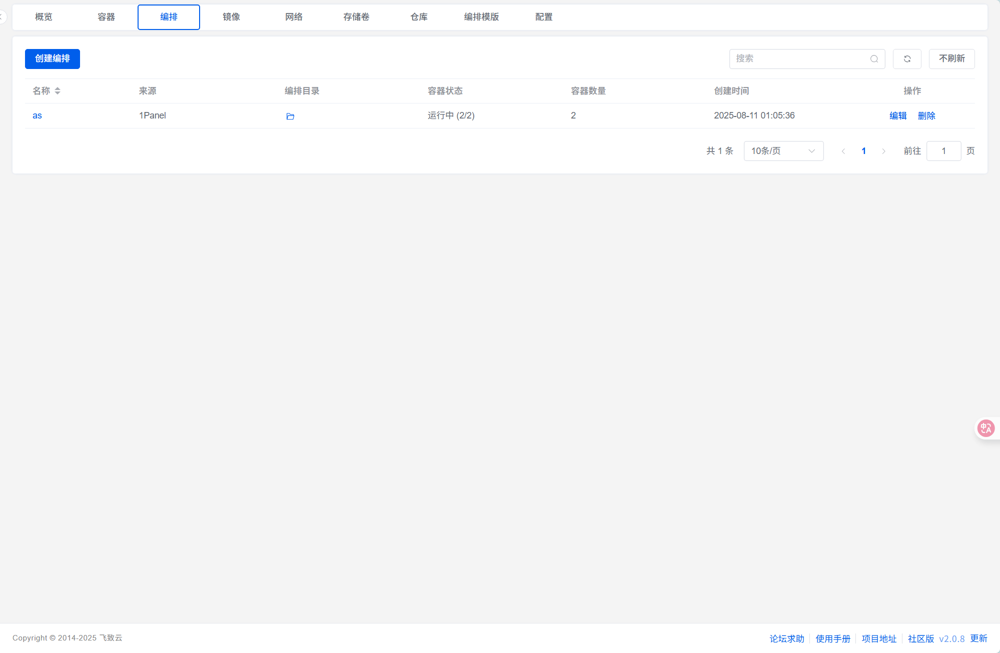
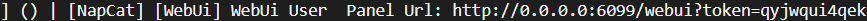

# qq机器人搭建教程

使用工具

- docker
- [AstrBot](https://docs.astrbot.app/)
- [NapCat | NapCatQQ](https://napneko.github.io/guide/napcat)
- [1Panel](https://1panel.cn/) （可选）

要求

- 一台有公网ip的云服务器（想体验一下可以先部署到本地）
- 一个qq小号

## Start

首先下载1panel。然后进入1panel 面板。容器-编排界面



创建编排，其实就是docker-compose.yml文件

内容如下：

```yaml
services:
  napcat:
    environment:
      - NAPCAT_UID=${NAPCAT_UID:-1000}
      - NAPCAT_GID=${NAPCAT_GID:-1000}
      - MODE=astrbot
    ports:
      - 6099:6099
    container_name: napcat
    restart: always
    image: swr.cn-north-4.myhuaweicloud.com/ddn-k8s/docker.io/mlikiowa/napcat-docker:latest
    volumes:
      - ./data:/AstrBot/data
      - ./ntqq:/app/.config/QQ
    networks:
      - astrbot_network
    mac_address: "02:42:ac:11:00:02"
  astrbot:
    environment:
      - TZ=Asia/Shanghai
    image: soulter/astrbot:latest
    container_name: astrbot
    restart: always
    ports:
      - "6185:6185"
      - "6195:6195"
      - "6199:6199"
    volumes:
      - ./data:/AstrBot/data
      - ./napcat/config:/app/napcat/config
      - ./ntqq:/app/.config/QQ
    networks:
      - astrbot_network
networks:
  astrbot_network:
    driver: bridge
```

其中两个image 字段是可以根据自己要求更改的，因为网络问题，docker 仓库可能没法访问，所以需要镜像。

然后就等待创建

## 配置bot

docker 创建结束后，分别访问。`你的ip:6185`和`你的ip:6099/webui`。一个是astrbot的ui，一个是napcat的ui。

首先配置napcat:

打开1panel的dockerk界面，进入napcat容器的日志，如果运行成功的话，应该会有二维码，用小号扫描登录。翻到日志最上方，找到token,使用token登录webui


进入webui后，找到webSoket监听地址，填入`ws://<astrbot本地地址>:6199/ws`

在1panel面版中可以找到astrbot容器的本地地址。

然后配置astrbot。点击消息平台-新增适配器-接入qq个人号-启用-保存

接下来可以在qq中测试/help，来确认。

更多功能可探索astrbot的插件商场，官方文档。

