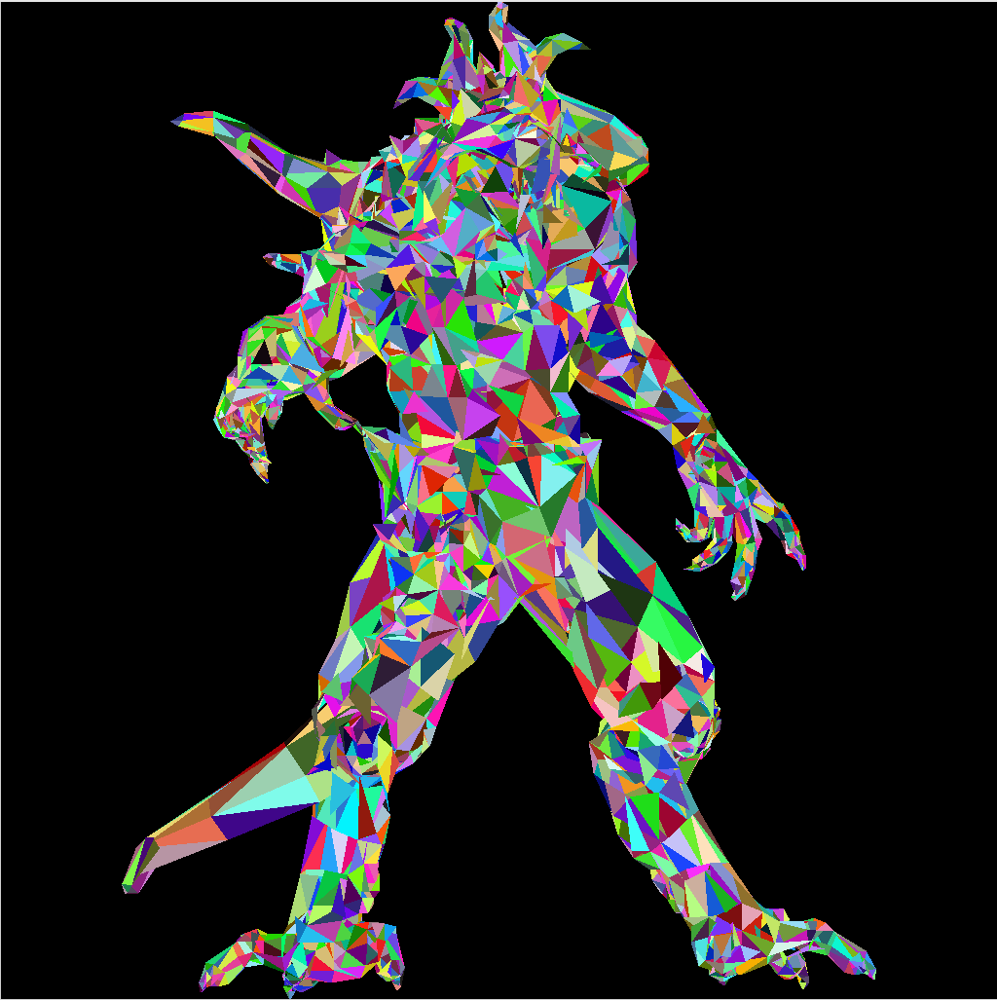
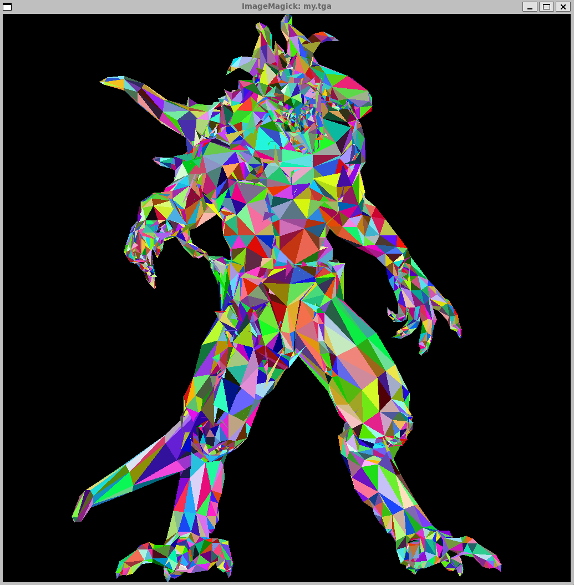

# tinyrenderer 学习笔记（二）

本节主要讲了画三角形的事情，介绍了两种画三角形的方案。一种是以前并行计算还不怎么流行时，还有一直是gpu采用的并行计算方法，同时也是game101中提到的方法。

## cpuVersion

cpu的计算版本就是先把三角形的三个坐标点按y坐标排序，由小到大。然后按行填写。总共两个for循环，循环变量为y。每次计算出两个x边界，然后一个循环进行着色。

为了做测试，采用了上次作业的几何图，然后随机上色。

效果如下图：



## gpuVersion

gpu的代码结构就非常简单了，就是计算出框出三角形的一个矩形框，遍历矩形框中的像素，然后判断该像素是否属于三角形内。

关键就是在于如何判断在三角形内，这里采用的叉乘的方法。p点到三点的向量分别与三遍向量叉乘，然后判断z轴方向即可。

代码如下：

```c++
int dicardProject(float x1, float x2, float y1, float y2) {
    return x1 * y2 - x2 * y1;
}

bool inTriangle(float i, float j, int ax, int ay, int bx, int by, int cx, int cy) {
    int tmp1 = dicardProject(i - ax, j - ay, bx - ax, by - ay);
    int tmp2 = dicardProject(i - bx, j - by, cx - bx, cy - by);
    int tmp3 = dicardProject(i - cx, j - cy, ax - cx, ay - cy);
    return ((tmp1 ^ tmp2) >= 0) && ((tmp1 ^ tmp3) >= 0);
}
```

注意这里的小技巧，判断两个数是否同号可以用$(x^y) >= 0$ 来判断。

最终效果如下：



## 性能测试

出于好奇，我想测试一下这两者的性能差异。于是让ai帮我写了一个测试程序。

我一开始认为现代cpu并行化程度已经挺高了，可能gpu版本还要快一些。最终还是cpu版本快得多。因此在之后的测试中我将使用cpu版本。性能测试结果如下：

| 三角形数量 | CPU平均(ms) | CPU范围(ms) | GPU平均(ms) | GPU范围(ms) | 性能比 |
|-----------|------------|------------|------------|------------|-------|
| 10        | 0.73       | [0.70-0.77] | 1.89       | [1.73-2.07] | 2.58x |
| 50        | 2.58       | [2.44-2.73] | 8.02       | [6.55-9.80] | 3.11x |
| 100       | 5.29       | [4.29-7.22] | 10.51      | [10.16-10.92] | 1.99x |
| 200       | 9.32       | [9.09-10.23] | 21.97     | [21.82-22.26] | 2.36x |
| 500       | 23.49      | [22.99-24.67] | 57.74    | [56.15-60.14] | 2.46x |
| 1000      | 47.30      | [45.64-48.91] | 112.24   | [111.03-114.09] | 2.37x |
