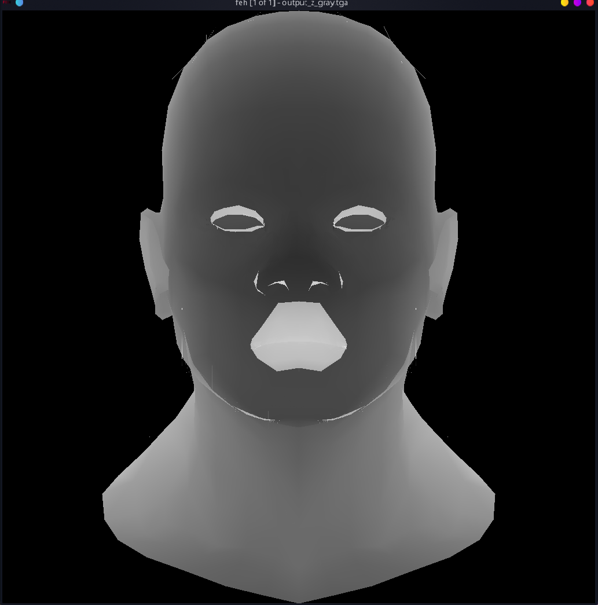
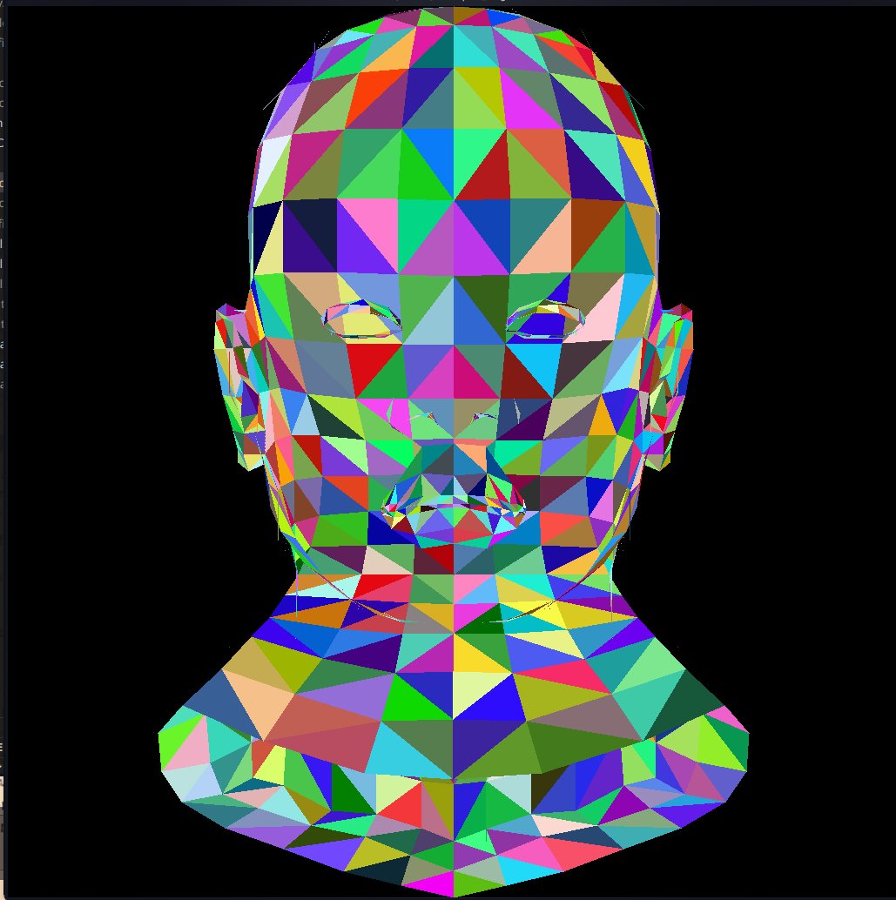

# tinyrenderer 学习笔记（三）

本节主要是使用z-buffer算法区别图形的深度。
同时学习重心坐标插值法，对深度进行插值。

## 重心坐标插值

三角形中任意一点可以表示为如下形式

$$r_c= \alpha*\vec{A}+\beta*\vec{B}+\gamma*\vec{C}$$
$$ \alpha + \beta + \gamma = 1$$

由数学推导可知，$\alpha,\beta,\gamma$ 与 点的对边构成的三角形面积成正比。再利用向量叉积求得三角形面积

实现代码如下：
```c++

int get_p(int ax,int ay,int bx,int by,int cx,int cy){
	return ((bx-ax)*(cy-ay) - (cx-ax)*(by-ay));
}


double get_area(int ax,int ay,int bx,int by,int cx,int cy){
	return 1.0*get_p(ax,ay,bx,by,cx,cy)/2.0;
}
```
注意这里的三角形面积是有正负的，这里保留正负，也是为了方便后面判断该点是否在三角形内。

```c++
double S1 = get_area(x,y,t1.x,t1.y,t2.x,t2.y);
double S2 = get_area(x,y,t2.x,t2.y,t0.x,t0.y);
double S3 = get_area(x,y,t0.x,t0.y,t1.x,t1.y);

		// 判断同号
if(S1*S2<0||S1*S3<0) continue;

double alpha = S1/full_square;
double beta = S2/full_square;
double gamma = S3/full_square;
```
通过这段代码求得 $\alpha,\beta,\gamma$ 。接下来就可以利用这三个数来插值

## z-buffer算法
伪代码描述如下：
```
for each triangle t:
    for each pixel p that t covers:
        compute its depth z
        if depth buffer at p < z:
            update the depth buffer with z
            paint the pixel
```
可以准备一个单独的z-buffer数组进行绘制。

## 成果
这个原理很简单，但是就是很奇怪，我画出来的图就是有点问题。有可能是浮点数精度问题。图里面总是会有一些奇怪的线。

成果图如下：
灰度图



RGB图

